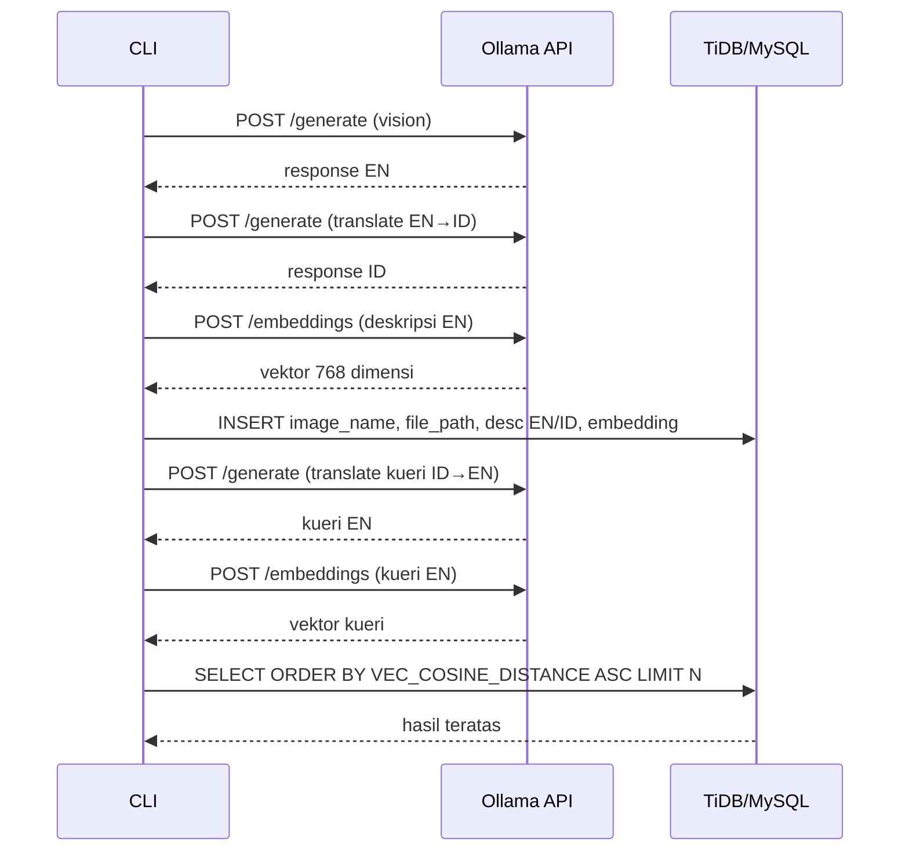

# Smart Gallery CLI – Semantic Image Search

CLI Python untuk melakukan indexing gambar dan pencarian semantik menggunakan Ollama (vision, embeddings) dan TiDB/MySQL sebagai penyimpanan vektor.

## Fitur

- Indexing gambar dari folder lokal (otomatis membuat deskripsi EN dan terjemahan ID)
- Pencarian semantik berbasis vektor dengan peringkat `VEC_COSINE_DISTANCE`
- Mendukung format `.png`, `.jpg`, `.jpeg`
- Menu CLI interaktif yang mudah digunakan

## Prasyarat

- Python 3.8+
- Ollama terpasang dan berjalan
- Akses ke TiDB/MySQL yang mendukung tipe `VECTOR<FLOAT>(768)` dan fungsi `VEC_COSINE_DISTANCE`

## Instalasi

Install dependensi:

```bash
pip install -r requirements.txt
```

Pull model Ollama yang diperlukan:

```bash
ollama pull llava:7b
ollama pull nomic-embed-text
```

## Konfigurasi

Siapkan file `.env` di root proyek. Contoh minimal:

```env
DB_HOST=host.com
DB_PORT=4000
DB_USERNAME="username"
DB_PASSWORD="password"
DB_DATABASE="smart_gallery"

OLLAMA_API="http://localhost:11434/api"
IMAGE_FOLDER="./sample-image"

VISION_MODEL="llava:7b"
TRANSLATE_MODEL="llava:7b"
EMBED_MODEL="nomic-embed-text"
```

Variabel ini dibaca oleh program melalui `python-dotenv`. Lihat implementasi di [main.py](file:///Users/bytedance/git-repo/python-images-search/main.py).

## Skema Database

Jalankan SQL berikut agar skema selaras dengan implementasi saat ini:

```sql
CREATE DATABASE IF NOT EXISTS smart_gallery;
USE smart_gallery;

CREATE TABLE IF NOT EXISTS image_vectors (
  id BIGINT AUTO_INCREMENT PRIMARY KEY,
  image_name VARCHAR(255) NOT NULL,
  file_path VARCHAR(1024),
  description TEXT,
  description_id TEXT,
  embedding VECTOR<FLOAT>(768),
  created_at DATETIME DEFAULT CURRENT_TIMESTAMP
);
```

Catatan: Model `nomic-embed-text` menghasilkan vektor berdimensi 768, sehingga tipe vektor pada tabel diatur ke `VECTOR<FLOAT>(768)`.

## Menjalankan

1. Pastikan `.env` sudah diisi dan database siap.
2. Pastikan Ollama aktif dan model sudah di-pull.
3. Jalankan CLI:

```bash
python main.py
```

Menu utama akan menampilkan opsi:
- `1` Indexing foto: memproses semua gambar di `IMAGE_FOLDER` dan menyimpan ke DB
- `2` Cari foto: pencarian semantik menggunakan kueri dalam Bahasa Indonesia
- `3` Keluar

Implementasi menu ada di [main.py](file:///Users/bytedance/git-repo/python-images-search/main.py#L160-L199).

## Arsitektur Singkat

- Indexing: vision (EN) → translate (ID) → embeddings (EN) → simpan ke DB
- Pencarian: translate kueri (ID→EN) → embeddings → `ORDER BY VEC_COSINE_DISTANCE ASC`
- Rujukan fungsi: [index_images](file:///Users/bytedance/git-repo/python-images-search/main.py#L36-L92), [search_images](file:///Users/bytedance/git-repo/python-images-search/main.py#L96-L146)

## Diagram Alur Teknis Panggilan API



## Lisensi

MIT

## Kontribusi

Kontribusi dipersilakan. Silakan ajukan pull request atau buka issue.
